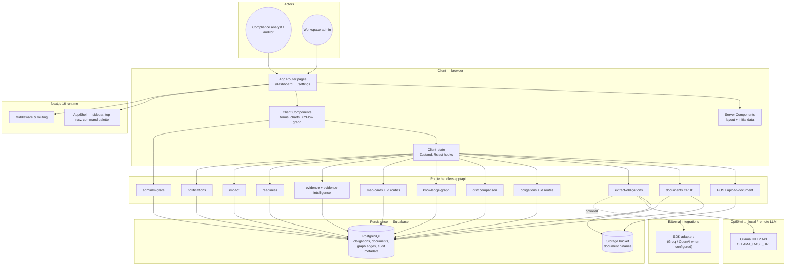

<!-- README images use GitHub Release assets (not raw.githubusercontent.com) so Camo can load them reliably — same pattern as KNOWLEDGE-BASE / MediTrustChain. Release: readme-screenshots. After new captures, re-upload files to that release and keep filenames stable. -->

<div align="center">

<a href="https://github.com/PRAJWAL-BR-0304/suraksha-compliance-os">
  
</a>

<br/>

[](https://nextjs.org/)
[](https://www.typescriptlang.org/)
[](https://react.dev/)
[](https://tailwindcss.com/)
[](https://github.com/PRAJWAL-BR-0304/suraksha-compliance-os)

**Enterprise-style compliance workspace — documents, obligations, drift, evidence, and audit readiness in one application.**

[Repository](https://github.com/PRAJWAL-BR-0304/suraksha-compliance-os) · [Issues](https://github.com/PRAJWAL-BR-0304/suraksha-compliance-os/issues)

</div>

---

## Contents

- [Overview](#overview)
- [System architecture](#system-architecture)
- [Feature map](#feature-map)
- [UI gallery](#ui-gallery)
- [Getting started](#getting-started)
- [Scripts & tooling](#scripts--tooling)
- [Security](#security)
- [License](#license)

---

## Overview

**Suraksha OS** is a compliance operations product for teams that must **ingest regulatory documents**, **extract and manage obligations**, **compare document versions (drift)**, **collect evidence**, and **report readiness** for audits — with analytics, a **MAP board** for control mapping, and a **knowledge graph** for relationship exploration.

| Layer | Technology |
|--------|------------|
| **Framework** | Next.js 16 (App Router, Turbopack in dev) |
| **UI** | React 19, Tailwind CSS v4, Framer Motion, Recharts |
| **Data** | Supabase (PostgreSQL + Storage) when configured |
| **Optional AI** | Ollama-compatible HTTP API for local extraction workloads |

---

## System architecture

High-level view of how the browser, Next.js surfaces, API route handlers, persistence, and optional LLM inference connect. Arrows show the dominant **request and data** directions (not every internal import).



**Narrative:** analysts use **pages** built from **RSC + client islands**. Interactive flows call **typed REST-style route handlers** under `app/api`, which enforce server-only secrets and talk to **Postgres** (structured compliance data) and **object storage** (files). Heavy **obligation extraction** can fan out to **Ollama** or cloud SDKs without exposing keys to the browser.

---

## Feature map

| Module | Purpose |
|--------|---------|
| **Dashboard** | Executive KPIs, trends, and activity |
| **Upload** | Secure document intake pipeline |
| **Documents** | Library, processing state, lifecycle |
| **Obligations** | Normalized duties and controls |
| **MAP Board** | Mapping obligations to control cards |
| **Knowledge Graph** | Entity–relationship exploration (XYFlow) |
| **Drift** | Pairwise document comparison |
| **Readiness** | Audit readiness posture |
| **Evidence** | Evidence lines and intelligence |
| **Impact** | Change / impact analysis |
| **Audit trail** | Historical activity |
| **Analytics & reports** | Metrics and exportable views |
| **Settings** | Workspace and organization preferences |

---


### Executive Dashboard

<p align="center">
  <kbd>
    <a href="https://github.com/PRAJWAL-BR-0304/suraksha-compliance-os/releases/download/readme-screenshots/01-dashboard.png">
      
    </a>
  </kbd>
  <br />
  <strong>Executive Dashboard</strong><br />
  <code>/dashboard</code> — KPIs, charts, recent activity. Tenant roles use <code>/dashboard/&lt;organizationSlug&gt;/compliance</code> (and similar leaves); the top bar shows the bank name and slug.
</p>

### Upload

<p align="center">
  <kbd>
    <a href="https://github.com/PRAJWAL-BR-0304/suraksha-compliance-os/releases/download/readme-screenshots/02-upload.png">
      
    </a>
  </kbd>
  <br />
  <strong>Upload</strong><br />
  <code>/upload</code> — Document ingestion
</p>

### Documents

<p align="center">
  <kbd>
    <a href="https://github.com/PRAJWAL-BR-0304/suraksha-compliance-os/releases/download/readme-screenshots/03-documents.png">
      
    </a>
  </kbd>
  <br />
  <strong>Documents</strong><br />
  <code>/documents</code> — Library and processing status
</p>

### Obligations

<p align="center">
  <kbd>
    <a href="https://github.com/PRAJWAL-BR-0304/suraksha-compliance-os/releases/download/readme-screenshots/04-obligations.png">
      
    </a>
  </kbd>
  <br />
  <strong>Obligations</strong><br />
  <code>/obligations</code> — Extracted requirements
</p>

### MAP Board

<p align="center">
  <kbd>
    <a href="https://github.com/PRAJWAL-BR-0304/suraksha-compliance-os/releases/download/readme-screenshots/05-map-board.png">
      
    </a>
  </kbd>
  <br />
  <strong>MAP Board</strong><br />
  <code>/map-board</code> — Control mapping workspace
</p>

### Knowledge Graph

<p align="center">
  <kbd>
    <a href="https://github.com/PRAJWAL-BR-0304/suraksha-compliance-os/releases/download/readme-screenshots/06-knowledge-graph.png">
      
    </a>
  </kbd>
  <br />
  <strong>Knowledge Graph</strong><br />
  <code>/knowledge-graph</code> — Relationship explorer
</p>

### Drift Analyzer

<p align="center">
  <kbd>
    <a href="https://github.com/PRAJWAL-BR-0304/suraksha-compliance-os/releases/download/readme-screenshots/07-drift.png">
      
    </a>
  </kbd>
  <br />
  <strong>Drift Analyzer</strong><br />
  <code>/drift</code> — Version comparison
</p>

### Readiness

<p align="center">
  <kbd>
    <a href="https://github.com/PRAJWAL-BR-0304/suraksha-compliance-os/releases/download/readme-screenshots/08-readiness.png">
      
    </a>
  </kbd>
  <br />
  <strong>Readiness</strong><br />
  <code>/readiness</code> — Audit readiness posture
</p>

### Evidence

<p align="center">
  <kbd>
    <a href="https://github.com/PRAJWAL-BR-0304/suraksha-compliance-os/releases/download/readme-screenshots/09-evidence.png">
      
    </a>
  </kbd>
  <br />
  <strong>Evidence</strong><br />
  <code>/evidence</code> — Evidence collection
</p>

### Impact

<p align="center">
  <kbd>
    <a href="https://github.com/PRAJWAL-BR-0304/suraksha-compliance-os/releases/download/readme-screenshots/10-impact.png">
      
    </a>
  </kbd>
  <br />
  <strong>Impact</strong><br />
  <code>/impact</code> — Change impact view
</p>

### Audit Trail

<p align="center">
  <kbd>
    <a href="https://github.com/PRAJWAL-BR-0304/suraksha-compliance-os/releases/download/readme-screenshots/11-audit.png">
      
    </a>
  </kbd>
  <br />
  <strong>Audit Trail</strong><br />
  <code>/audit</code> — Activity and history
</p>

### Analytics

<p align="center">
  <kbd>
    <a href="https://github.com/PRAJWAL-BR-0304/suraksha-compliance-os/releases/download/readme-screenshots/12-analytics.png">
      
    </a>
  </kbd>
  <br />
  <strong>Analytics</strong><br />
  <code>/analytics</code> — Metrics and trends
</p>

### Reports

<p align="center">
  <kbd>
    <a href="https://github.com/PRAJWAL-BR-0304/suraksha-compliance-os/releases/download/readme-screenshots/13-reports.png">
      
    </a>
  </kbd>
  <br />
  <strong>Reports</strong><br />
  <code>/reports</code> — Compliance reporting
</p>

### Settings

<p align="center">
  <kbd>
    <a href="https://github.com/PRAJWAL-BR-0304/suraksha-compliance-os/releases/download/readme-screenshots/14-settings.png">
      
    </a>
  </kbd>
  <br />
  <strong>Settings</strong><br />
  <code>/settings</code> — Organization preferences
</p>

---

## Getting started

```bash
git clone https://github.com/PRAJWAL-BR-0304/suraksha-compliance-os.git
cd suraksha-compliance-os
npm install
cp .env.example .env.local   # fill with real values — never commit .env.local
npm run dev
```

Open **http://localhost:3000** (or the port printed in the terminal).

---

## Scripts & tooling

| Command | Purpose |
|---------|---------|
| `npm run dev` | Next.js development (Turbopack) |
| `npm run build` | Production build |
| `npm run start` | Production server |
| `npm run lint` | ESLint |
| `npm run test` | Repository verification + secret scan |
| `npm run test:backend` | Full backend & database E2E test suite |
| `npm run test:e2e` | Playwright browser + UI end-to-end tests |
| `npm run test:e2e:roles` | Playwright **per-role browser crawl**: UI login, every nav route, screenshots + error capture → `test-results/role-crawl/` |
| `npm run test:e2e:full` | **Complete E2E suite** mirroring `docs/COMPLETE_E2E_TEST_PLAN.md`: auth, RBAC/ABAC/IDOR/validation API matrix, per-role dashboards + nav crawl, CRUD workflow → `test-results/complete-suite/` |
| `npm run seed:demo` | Idempotent demo seed: org-scoped documents, obligations, evidence, MAP cards, escalations, audit, security findings, notifications |
| `npm run seed:enterprise` | Seed the enterprise hierarchy: 1 Founder + 3 banks (HDFC/ICICI/Axis), each with a Bank Manager, departments, teams, users |
| `npm run test:enterprise` | Founder/Manager isolation audit (founder sees all, non-founder blocked, manager cannot cross tenants) |
| `npm run qa` | **Full QA suite**: seed → business flows with **DB-state validation after each transaction** → per-role dashboard/page screenshots → defect log → `docs/QA_REPORT.md` + `test-results/qa/` |
| `npm run test:security` | Security audit — IDOR, RLS, authz, token manipulation |
| `npm run verify` | File presence and API guard smoke-checks |
| `npm run scan:secrets` | Secret pattern scan across repository |
| `npm run db:clear-org` | Clear compliance data for **one** org: `npm run db:clear-org -- <org-slug> --yes` (service role in `.env.local`) |
| `npm run db:clear-all-compliance` | Clear compliance data for **every** org: `npm run db:clear-all-compliance -- --yes` (keeps orgs, users, departments, teams, `regulatory_sources`) |

## Database migrations

The source of truth for the schema is `supabase/migrations/` — **not** `supabase/schema.sql`.

Apply migrations **001–012** in order on a **new** database (SQL Editor or Supabase CLI), then run the bundled enterprise + agentic script for **013–023**:

```bash
SUPABASE_DB_PASSWORD=... node scripts/apply-enterprise-migrations.cjs
```

That applies, in order, `013_enterprise_roles.sql` through `025_orchestration_dedupe.sql` (hero KPIs, tenant hardening, regulatory PDF trace columns, regulatory source slots + fetch health, and orchestration dedupe). For a single file (e.g. hotfix), use:

```bash
node scripts/apply-db-migration.cjs supabase/migrations/023_regulatory_pdf_ingestion.sql
```

Or `npm run db:apply-migration:api -- supabase/migrations/023_regulatory_pdf_ingestion.sql` with a PAT that has **database write**, or paste into the Supabase SQL Editor.

```bash
supabase db push   # if CLI is configured
```

Or paste each file manually in the Supabase dashboard SQL Editor.

### Migration summary

| File | Description |
|------|-------------|
| 001_core_schema.sql | Core tables, enums, indexes, triggers |
| 002_extended_schema.sql | Drift, readiness, impact, graph, notifications, escalations, departments |
| 002_rls_policies.sql | Initial RLS + service-role policies |
| 003_enable_realtime.sql | Realtime publication for core tables |
| 004_dashboard_functions.sql | Dashboard KPI and activity RPCs |
| 005_seed_data.sql | Empty — seeding moved to migrations and admin route |
| 006_complete_alignment.sql | Column additions, realtime extended tables, analytics RPC |
| 007_auth_rbac_ai_integrations.sql | Multi-tenant auth, RBAC, AI review tables, integration findings |
| 008_abac_rls_hardening.sql | Department + assignment ABAC helpers and policies |
| 009_org_settings_column.sql | Org-level settings column |
| 010_rbac_org_admin_oversight.sql | org_admin full org oversight |
| 011_evidence_collected_nullable.sql | evidence.collected_at nullable |
| 012_dashboard_read_policies_and_kpis.sql | Dashboard read policies + KPI fields |
| 013_enterprise_roles.sql | `founder` + `bank_manager` roles |
| 014_enterprise_tenancy.sql | founders, per-org departments, teams, user_permissions |
| 015_enterprise_rbac_seed.sql | RBAC seed for founder + bank_manager |
| 016_founder_rls.sql | `is_founder()` + founder RLS bypass + manager scoping |
| 017_enterprise_audit_actions.sql | Audit action enum values for admin + agent events |
| 018_agentic.sql | regulatory_sources, regulatory_changes, agent_runs/events + provenance markers |
| 019_tenant_isolation_hardening.sql | Tenant isolation hardening |
| 020–021 | Enterprise follow-ups (see files under `supabase/migrations/`) |
| 022_dashboard_hero_kpis.sql | Dashboard hero KPIs + realtime `agent_events` / `regulatory_changes` |
| 023_regulatory_pdf_ingestion.sql | `resolved_pdf_url`, `pdf_storage_path`, `ingestion_error` on `regulatory_changes` (autonomous PDF path) |
| 024_regulatory_sources_slots_health.sql | `catalog_slot_id` (stable catalog key per org), `source_name` / `source_type`, fetch health columns (`last_fetch_*`), unique `(organization_id, catalog_slot_id)` |
| 025_orchestration_dedupe.sql | `obligations.obligation_fingerprint` + index; `regulatory_changes.status` adds `duplicate` (PDF checksum dedupe) |

### Agent service env (regulatory PDF + feeds)

Set in `agent-service/.env` (or process env):

| Variable | Default | Meaning |
|----------|---------|---------|
| `NEXT_PUBLIC_SUPABASE_DOCUMENTS_BUCKET` | `compliance-documents` | Storage bucket for uploaded PDFs |
| `SURAKSHA_REGULATORY_FEED_SAMPLES` | `false` | If `true`, injects sample RSS items when a feed fails (demo only) |
| `AUTOMATIC_PDF_STRICT` | `false` | If `true`, **requires** a resolved + stored PDF before obligations; otherwise falls back to RSS summary |
| `SURAKSHA_PDF_MAX_BYTES` | `36700160` (~35 MB) | Max PDF download size |
| `SURAKSHA_PDF_MIN_TEXT_CHARS` | `200` | Below this extracted text length, agent merges RSS summary (`needs_ocr` in metadata) |

Respect regulator site policies and rate limits when enabling autonomous downloads.

## Enterprise multi-tenancy

Suraksha OS is a multi-tenant platform: **Founder → Bank Manager → Department Owner → Team Member**.

- **Founder** (`/founder`): global owner. Creates/suspends banks, sees every tenant. Bypasses RLS via `is_founder()`; cross-tenant reads go through service-role founder APIs (`/api/founder/*`). When drilling into a bank (send `x-suraksha-org-id`), a founder can open **`/admin/users`** and edit the **bank manager’s login email and password** (API: `PATCH /api/admin/users/:id` with `email` / `password` for the `bank_manager` row only); this updates Supabase Auth, `profiles.email`, and `organizations.manager_email` on email change.
- **Bank Manager** (`bank_manager`): full admin within one bank — manage **other** users, departments, teams, roles, and per-user permission grants (`/admin/users|departments|teams|access`, APIs under `/api/admin/*`). The **bank manager** cannot change **their own** display name, **department**, **team**, login email, or password via that UI/API (403); they still manage departments, teams, and other users normally.
- **Department Owner / Team Member**: department- and assignment-scoped via ABAC + RLS.

Seed + verify:

```bash
npm run seed:enterprise   # founder + 3 banks
npm run test:enterprise   # isolation audit
```

## AI Agents (Google ADK)

A separate Python service in [`agent-service/`](agent-service/README.md) uses the
**Google Agent Development Kit** + **Gemini** to autonomously monitor regulatory
changes, resolve **PDF** links when present, upload to Supabase Storage, extract text from digital PDFs,
generate Measurable Action Points, assign them to departments, and
validate completion. The Next.js app drives it from the **Agents** workspace (`/dashboard/<org>/agents`) via
`/api/agents/*` proxy routes. **Regulatory sources** merge the static catalog (`lib/regulatory-feed-catalog.ts`) with per-tenant rows in `regulatory_sources`, keyed by **`catalog_slot_id`** (one logical feed per org per slot). **Feed URLs are editable** only when they pass the per-slot policy in `lib/regulatory-feed-url-policy.ts` (HTTPS, allowed hosts, optional path prefixes — no arbitrary domains). `GET|POST|PATCH /api/regulatory-sources` and `POST /api/regulatory-sources/test` enforce that policy; URL changes are audit-logged. **Health** (`healthy` / `delayed` / `failed` / `unknown`) is derived from `last_fetch_success_at`, `last_fetch_attempt_at`, and `last_fetch_error`. The agent service updates those timestamps on each **watch** scan (`watch_organization`); manual **Test** also records probe results. **Compliance automation** (`POST /api/agents/runs` with `pipeline: "full"` or `"validate"`) returns **HTTP 202** immediately with `run_id`; the dashboard **AI activity stream** updates via Supabase Realtime on `agent_events` without blocking the UI on a long poll modal. Agent-generated MAPs show an "AI Agent" badge on the MAP board.

Required Next.js env vars (in `.env.local`):

```
AGENT_SERVICE_URL=http://localhost:8088
AGENT_SHARED_SECRET=<same value as the agent service>
# Optional — ms; default 900000 (15m). Raise for slow local Ollama (max 3600000); align with `maxDuration` in `app/api/agents/runs/route.ts` on Vercel.
# AGENT_RUN_PROXY_TIMEOUT_MS=1800000
```

## Login credentials (demo)

| Role | Email | Password |
|------|-------|----------|
| Founder | founder@suraksha.local | SurakshaFounder@2026 |
| Bank Manager (HDFC) | manager@hdfc-bank.suraksha.local | SurakshaManager@2026 |
| Org Admin | admin@suraksha.local | SurakshaAdmin@2026 |
| Compliance Admin | compliance@suraksha.local | SurakshaCompliance@2026 |
| Security Team | security@suraksha.local | SurakshaSecurity@2026 |
| Internal Auditor | audit@suraksha.local | SurakshaAudit@2026 |
| Executive Viewer | executive@suraksha.local | SurakshaExecutive@2026 |
| Department Owner | owner@suraksha.local | SurakshaOwner@2026 |

> After login, forgot-password is available at `/forgot-password`.

---

## Security

- Do **not** commit `.env`, `.env.local`, or any file containing **Supabase service role** keys, **storage secrets**, or **third-party API tokens**.
- Rotate credentials that have been pasted into chat logs, tickets, or shared desktops.

---

## License

Private / unlicensed unless the repository owner adds an explicit **LICENSE** file.

---

<div align="center">

<sub>Suraksha OS — built for compliance and security engineering teams.</sub>

</div>
